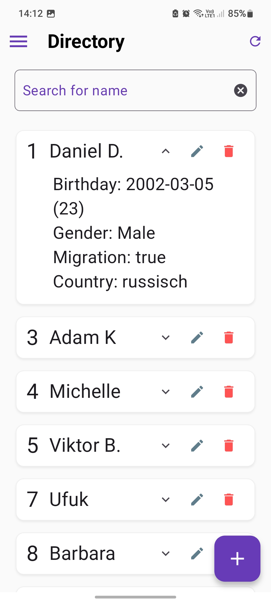
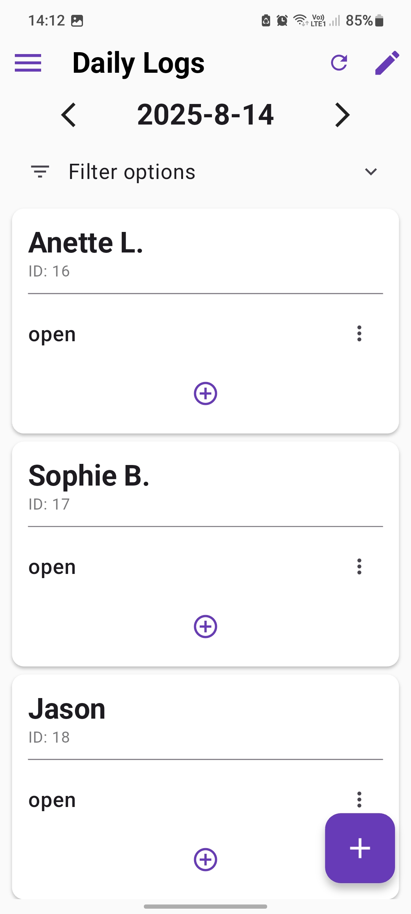
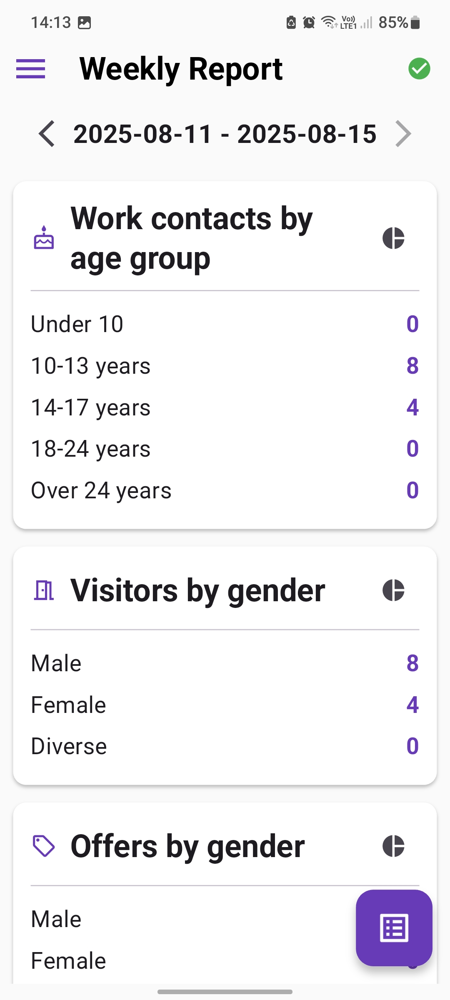
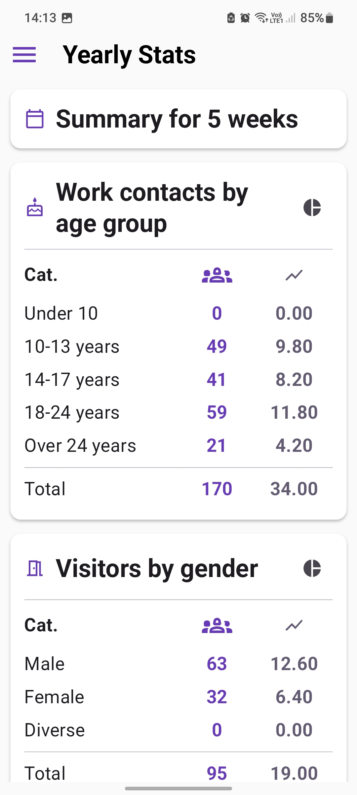

# Attendly

**Attendly** is an attendance and statistics tracking app developed specifically for a youth club.  
The goal is to simplify the creation of the club's **annual report** by providing accurate data and statistics in a ready-to-use format.

---

## ⚠️ Privacy Disclaimer

**Important:** The database is **not encrypted**.  
Do **not** enter real personal data such as exact birthdates or full identifying details.  
Instead, use slightly modified information (e.g., adjust the birthdate by a few days) to prevent potential misuse if the data is stolen.

---

## 📋 About the Project

Youth clubs often need to provide specific data and statistics in their annual reports.  
**Attendly** is tailored to their workflow, categories, and calculation logic.

**Key characteristics:**
- Designed specifically for youth clubs' reporting needs.
- Uses a **local SQLite database** (`sqflite`) stored on the device.
- Requires **full storage access** for database management and backups.
- Optimized for tracking attendance in various categories.
- Supports **German** and **English** languages.

---

## 📦 Installation

1. Download the latest APK from the [Releases](./releases) page.
2. Transfer the APK to your Android device.
3. Enable installation from unknown sources in your device settings.
4. Install the APK by opening it on your device.
5. On first launch, **grant full storage access** when prompted.

---

## 📂 Features Overview

### 1. Directory Page
Store and manage all registered attendees (children, teens, or parents).
  

---

### 2. Daily Logs
Assign attendees to categories for the current day.

**Categories:**
- **Open** (`Offener Bereich`) → Attendees currently in the facility.
- **Offers** (`Angebote`) → Attendees participating in activities like cooking, creative projects, etc.
- **Other** (`Sonstige`) → Contact made outside the facility (e.g., via social media).
- **Parent** (`Eltern`) → *Definition pending.*

---

### 3. Weekly Statistics
Track weekly attendance statistics and mark specific weeks as *counted* or *excluded* from reports.

---

### 4. Yearly Summary
Automatically sum up all collected data and present it visually with charts.

---

### 5. Help Page PDF
Located in the **Settings**, the Help page provides guidance on how to use the app’s features and explains each category. The guidance is only in German available.

---

## 🗄 Database

- **Type:** SQLite (via [`sqflite`](https://pub.dev/packages/sqflite))
- **Location:** Stored locally on the device.
- **Backup:** Users should manually copy database files from storage if needed.

---

## ⚠️ Permissions

- **Full Storage Access:** Required to read/write the local database and manage backups.

---

## 🌐 Language Support

- **German** 🇩🇪
- **English** 🇬🇧

<!-- ---

## 📜 License

This app is built for internal use by the youth club.  
Distribution outside of the club is not intended unless explicitly approved. -->